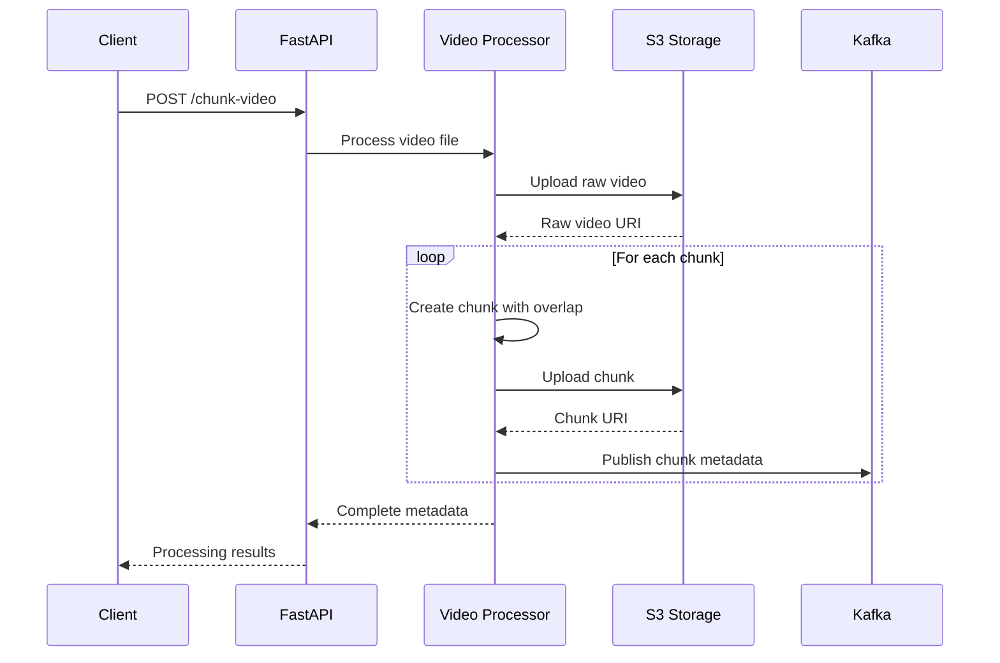

# Video Chunker

A high-performance video processing pipeline that chunks large video files into smaller, manageable segments for distributed processing and analysis.

## Purpose

The Video Chunker is designed to solve the challenge of processing large video files that are too big to handle as single units. It's particularly useful for:

- **Machine Learning Pipelines**: Breaking videos into chunks for parallel AI/ML processing
- **Content Analysis**: Processing video segments for object detection, scene analysis, or transcription
- **Streaming Optimization**: Creating smaller video segments for adaptive bitrate streaming
- **Distributed Processing**: Enabling parallel processing across multiple workers or services

## Data Flow



## How It Works

### 1. **Video Upload & Validation**

- Accepts video files via HTTP POST to `/chunk-video` endpoint
- Validates file type and content
- Generates unique video ID for tracking

### 2. **Video Processing**

- Uses MoviePy for video manipulation
- Extracts metadata (duration, FPS, codec info)
- Uploads original video to S3 raw videos bucket

### 3. **Chunking**

- Splits video into configurable duration chunks (default: 5 seconds)
- Implements overlap regions (default: 1 second) for context preservation
- Maintains video quality and encoding settings
- Creates temporary chunk files for processing

### 4. **Storage & Distribution**

- Uploads each chunk to S3 with comprehensive metadata
- Organizes chunks by video ID for easy retrieval
- Publishes chunk metadata to Kafka for downstream processing

### 5. **Response & Tracking**

- Returns complete processing metadata
- Includes S3 URIs for both raw video and all chunks
- Provides chunk timing and overlap information

## Development

This project uses UV for dependency management and testing.

The project includes comprehensive test coverage:

```bash
# Run all tests
make unit-tests
make integration-tests
make e2e-tests

# Format and lint code
make fmt
make lint
```

### Other utility scripts

```bash
ffmpeg -f lavfi -i color=c=black:s=16x16:d=1 -c:v libx264 -crf 51 -preset veryslow -tune stillimage -movflags +faststart -pix_fmt yuv420p ./tests/fixtures/smallest.mp4
```
